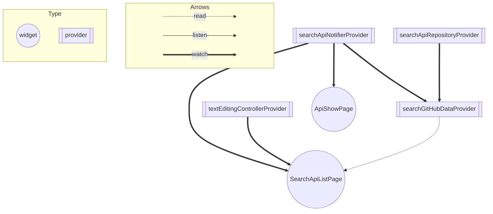

### バージョン情報

```bash

$ fvm --version
2.4.1

$ fvm flutter doctor
Doctor summary (to see all details, run flutter doctor -v):
[✓] Flutter (Channel stable, 3.3.10, on macOS 12.5 21G72 darwin-arm, locale ja-JP)
[✓] Android toolchain - develop for Android devices (Android SDK version 33.0.1)
[✓] Xcode - develop for iOS and macOS (Xcode 14.2)
[✓] Chrome - develop for the web
[✓] Android Studio (version 2021.3)
[✓] VS Code (version 1.74.2)
[✓] Connected device (3 available)
[✓] HTTP Host Availability

• No issues found!
```

### アプリの起動方法

```bash
$ cd このプロジェクトのルートディレクトリ

$ fvm install

$ fvm flutter --version
Flutter 3.3.10
Dart 2.18.6

$ fvm flutter pub get

vscodeから左の３番目からアプリを起動してください。

```

### コマンド
- テストコードのカバレッジ率を確認する
https://tech.andpad.co.jp/entry/2020/11/17/170000#%E3%82%AB%E3%83%90%E3%83%AC%E3%83%83%E3%82%B8%E3%81%AE%E8%A6%8B%E3%81%88%E3%82%8B%E5%8C%96

```bash
$ fvm flutter test --coverage
$ brew install lcov
$ genhtml coverage/lcov.info -o coverage/html

```

- ビルドランナーコマンド_Freezedやriverpod_generatorの更新をする際に使用
```bash
$ fvm flutter pub run build_runner build
```

<br />

## アーキテクチャー
オニオンアーキテクチャー
- application
- domain
- infrastructure
- presentation

## 機能一覧
- Must
  - API検索
  - 検索結果一覧
  - 詳細ページ
- Option
  - 本番、テスト、開発の切り分け
  - widgetテスト
  - CI

### riverpodのproviderやwidgetの関係性グラフ



## １度目に提出したコードからの改善点

- [１度目に提出したコード](https://github.com/masal9pse/flutter_engineer_codecheck/tree/5d222fbeba6776e10ddd66c2f05939d34d6299d7)にフィードバックいただいた部分に対して修正を行いました。

| １度目に頂いた技術的な改善点 | 修正点（特に１つ目と２つ目が今回のアピールポイント） |
|:-----------|------------:|
| 同じ例外をキャッチする処理を書いている箇所がいくつかあるので、SearchApiService で例外をキャッチした後、アプリ独自のデータに変換して以降の処理に渡すようにすると、それ以降の処理で例外をキャッチする必要がなくなり、可読性・保守性も向上するためおすすめです。  |   Result<T,E>を使用して同じ例外をキャッチしないようにしました。      |
| Widgetが1つの大きめのbuildメソッドで組まれていて可読性がやや低い     | Atomic Designを導入してコンポーネント化のルール化をしました。
| 一覧で要素をタップしても何も起こらない     | 詳細ページに飛べるよう修正しました。
| 文言はすべて lib/const/response_message.dart に定義するか、 多言語対応も見据えての arb ファイルに記載するようにするとより保守性が向上するためおすすめです。| constファイルに記載するようにしました。|
| pedantic_monoがpubspec.yamlで指定されているのにanalysis_options.yamlでは使われておらずチグハグ    |   静的解析のパッケージをFlutter公式が提示した推奨ルールを用いているflutter_listに変更しました。   |

<br />
<br />

## その他アピールポイント
- PR,issueテンプレートを導入して記載する内容の方針を決めました。
- 検索ボタンをタップすると検索結果が取得するまでindicatorを表示したり、正しく結果の取得できなかった際に原因を表示するなど、UXの向上をある程度意識しました。
- オニオンアーキテクチャー導入によりインフラ層のサービスを自由に差し替え可能な状態なりました。結果、ドメイン層がインフラストラクチャー層に依存しないようになりました。

### 開発のやり方
- 基本的には、まずissueを切って、コミットメッセージにissue番号を記載し飛べるようにする。
- その他、issueに関連しない修正もコミットメッセージで修正内容が伝わるようにする。
  - 以前はPRを切っていたが現状、個人開発であること＋PR毎にレビューしてマージする必要がないのでこの開発手法にしました。
- featureの機能を実装する場合は、必ずテストを書いてクローズさせる
- その機能、修正等をマージするか分からない、コードを書いて判断したい場合はブランチを切ってPRを出す。