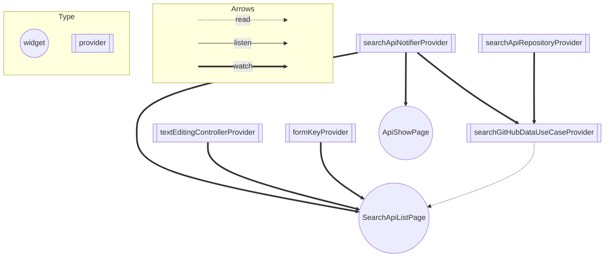

※ readmeおよびコードも整備中です

### バージョン情報

```bash

$ fvm --version

$ fvm flutter doctor

```
### 動作
* 何かしらのキーワードを入力できる
* 入力したキーワードで GitHub のリポジトリを検索できる
* 検索結果は一覧で概要（リポジトリ名）を表示する
* 検索結果のアイテムをタップしたら、該当リポジトリの詳細（リポジトリ名、オーナーアイコン、プロジェクト言語、Star 数、Watcher 数、Fork 数、Issue
  数）を表示する

### アプリの起動方法

```bash

$ fvm install

$ fvm flutter pub get

launch.jsonの環境に応じてアプリを起動できます。

```

### コマンド
- テストコードのカバレッジ率を確認する
https://tech.andpad.co.jp/entry/2020/11/17/170000#%E3%82%AB%E3%83%90%E3%83%AC%E3%83%83%E3%82%B8%E3%81%AE%E8%A6%8B%E3%81%88%E3%82%8B%E5%8C%96

```bash
$ fvm flutter test --coverage
$ brew install lcov
$ genhtml coverage/lcov.info -o coverage/html

```

- ビルドランナーコマンド_Freezedやriverpod_generatorの更新をする際に使用
```bash
$ fvm flutter pub run build_runner build
```

<br />

## アーキテクチャー
- オニオンアーキテクチャーを使用
基本的には[こちらの記事](https://zenn.dev/streamwest1629/articles/no-clean_hello-onion-architecture#%E3%82%AA%E3%83%8B%E3%82%AA%E3%83%B3%E3%82%A2%E3%83%BC%E3%82%AD%E3%83%86%E3%82%AF%E3%83%81%E3%83%A3%E3%81%AE%E6%8F%90%E6%A1%88:~:text=%E3%81%84%E3%82%8B%E3%81%AE%E3%81%A7%E3%81%99%E3%80%82-,%E3%82%AA%E3%83%8B%E3%82%AA%E3%83%B3%E3%82%A2%E3%83%BC%E3%82%AD%E3%83%86%E3%82%AF%E3%83%81%E3%83%A3%E3%81%AE%E6%8F%90%E6%A1%88,-%E3%81%93%E3%81%93%E3%81%A7%E3%80%81%E3%83%9C%E3%82%AF)を参考にして実装

## フォルダ構成

```

├── lib
│   ├── main.dart             # アプリのエントリーポイント
│   ├── application_services  # アプリケーション固有のロジックを持つ
│       ├── config            # アプリの設定ファイル、環境変数の設定など
│       ├── const             # アプリで使用する共通の文言等
│       ├── di                # riverpodのproviderを用いて、依存性注入を行う
│       ├── state             # riverpodの状態管理(notifierとprovider)を担当
│       ├── use_case          # ユーザーからみたシステムの振る舞いを定義
│   ├── domain                # ビジネスロジックの実装とドメインモデルの管理
│       ├── model             # ドメインモデルと共通で使用するモデル(Result、AppError型)の管理
│       ├── repository        # 外部サービスの抽象クラス
│   ├── presentation          # 見た目
│       ├── components        # コンポーネント、riverpodには依存しないようにする
│           ├── atoms         # UIの最小単位
│           ├── molecules     # Atomsをいくつか組み合わせたもの
│           ├── organisms     # moleculesをいくつか組み合わせたもの
│       └── pages             # ページ
│   ├── infrastructure        # 外部サービスのやり取り、ドメインサービス層で用意したrepositoryの実態

```

### riverpodのproviderやwidgetの関係性グラフ


